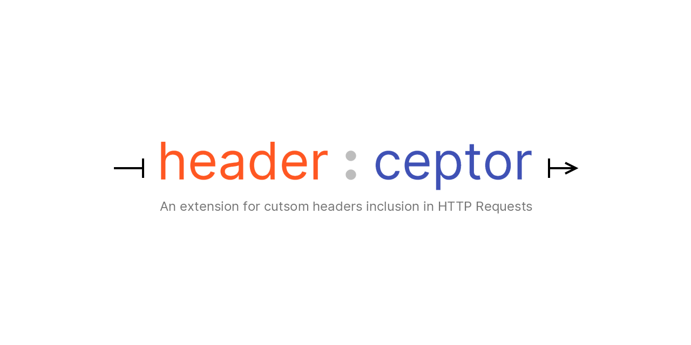

    

### About
---
Headerceptor is a Burp Suite extension which offers adding custom/user-defined headers to incoming HTTP traffic hassle-free.

### Screenshot
---

### Download and install
---
You can download the extension from the [releases](https://github.com/254Labs/headerceptor/releases) page. 
Follow [Installing Headerceptor](https://github.com/254Labs/headerceptor/wiki/Installing-Headerceptor) to successfully complete the installation.

### Documentation
---
Please find more information in the project`s [wiki](https://github.com/254Labs/headerceptor/wiki/) page.
